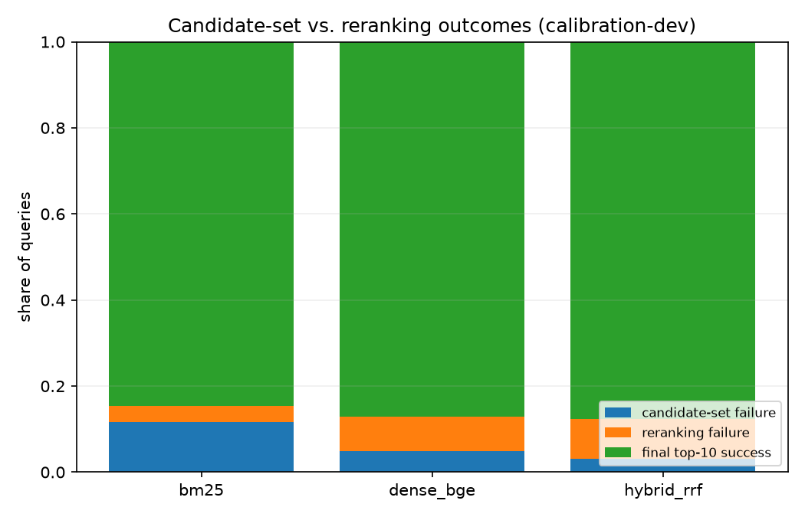
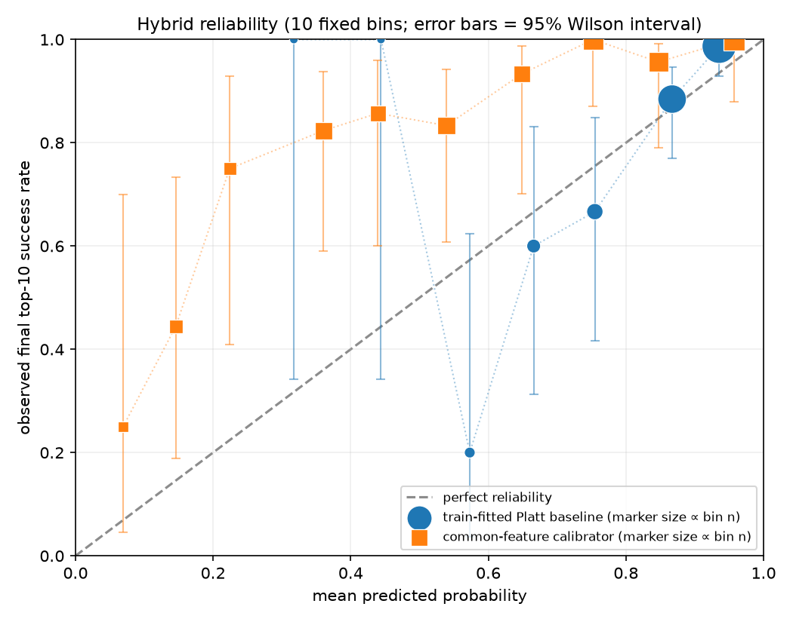
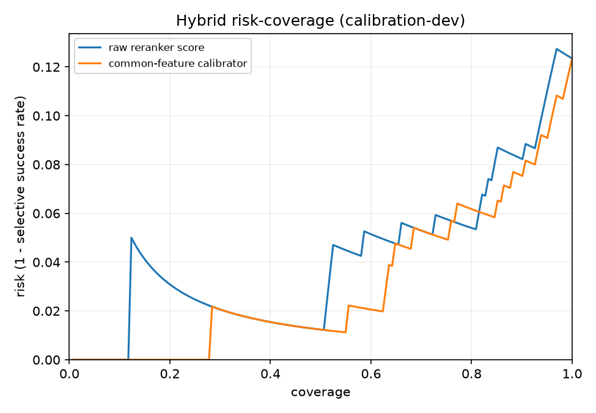

# 1. Introduction

A two-stage retrieval pipeline can fail in two structurally different ways. Either the first
stage never surfaces the relevant document, in which case the reranker is irrelevant to the
outcome, or the first stage surfaces it and the reranker fails to put it near the top. These
demand opposite remedies — better recall in the first case, a better reranker in the second —
but a single Recall@10 or nDCG@10 number does not distinguish them.

This study asks three questions on SciFact, a scientific claim-verification dataset whose
retrieval task is to find the abstract containing the annotated evidence for a claim:

1. How do lexical, dense, and hybrid first-stage retrieval compare on candidate recall?
2. When each pipeline fails, is it a candidate-set failure or a reranking failure — and does
   that composition change as the first stage improves?
3. Can a lightweight model, using only signals available at inference time, predict which
   queries will fail better than the reranker's own top score?

The scope is deliberately narrow. No model is fine-tuned, no dataset is added, and no attempt
is made to build a better retriever. The contribution is a decomposition and an honest
accounting of it, including two results that came out the wrong way.

## 1.1 Related work

SciFact frames scientific claim verification as selecting abstracts that contain evidence for
or against a claim, with annotated rationales [1]. This makes it a useful setting for separating
retrieval failure from downstream ranking failure: an abstract that never enters the candidate
set cannot be recovered by a reranker. We use SciFact through BEIR, a heterogeneous benchmark
designed for zero-shot information-retrieval evaluation across datasets and task types [2].

The first-stage comparison follows the standard lexical-versus-dense distinction. BM25 provides
a strong term-matching baseline [3], here through the `bm25s` implementation [4], while BGE
supplies a frozen neural bi-encoder trained with the C-Pack recipe [5]. The hybrid system uses
Reciprocal Rank Fusion, a rank-based combination that does not require the component scores to
share a scale [6].

The second stage follows the BERT cross-encoder reranking design of Nogueira and Cho [7], using
a model trained on MS MARCO [8]. BEIR reports that such rerankers give strong zero-shot
transfer on average while BM25 remains competitive on individual datasets [2]; the results in
§3.3 and §3.5 are a domain-specific instance of that variance rather than a contradiction of it.
Because the reranker is frozen, this study measures the interaction between candidate recall and
reranking rather than training a new end-to-end system.

The confidence model is closest to post-retrieval query performance prediction, which estimates
how well a system has done on a query from the retrieval output itself, without relevance
judgments [9]. The formulation here differs in target and use: instead of predicting a graded
effectiveness score, it predicts the binary event that the pipeline's final top 10 contains
annotated evidence, which is the quantity an abstention policy actually needs. Reporting it as a
risk-coverage trade-off places it in the selective-prediction framework, where a model may
decline to answer in order to lower error on what it does answer [10].

Calibration is evaluated separately from ranking quality because a score can order failures well
while still producing poor probabilities. The raw cross-encoder logit is not a probability, so
the Brier baseline is a Platt scaling of it fitted on training data only [11]; calibrated
confidence is taken in the usual sense of a probability representative of empirical correctness
[12]. The contribution is not a new calibration method. It is an explicit failure taxonomy and
an evaluation protocol that keeps candidate-set errors, reranking errors, ranking quality, and
probability calibration distinct, evaluated once on held-out data.

# 2. Method

## 2.1 Data and splits

SciFact is accessed through `ir_datasets` as `beir/scifact`: a corpus of 5,183 abstracts, 809
training claims, and 300 test claims. Every training claim has at least one positive relevance
judgment. The 809 training claims are partitioned 80/20 into 647 calibration-train and 162
calibration-dev queries, by sorting the query IDs and shuffling with `random.Random(42)`;
sorting before shuffling makes the split independent of `ir_datasets` iteration order across
versions. The resulting query-ID files are committed.

The 300-query test split was held out for the entire development of the study and opened exactly
once, at the end, for the evaluation in §3.5. It was not merely unused: the calibration split
resolver accepts only the two calibration split names and raises on anything else, including
`test` and `beir/scifact/test`, and a unit test asserts this. Reaching the held-out data requires
calling a separately named loader, so opening it is an explicit and greppable act rather than a
string argument away. All 300 test queries have at least one positive judgment.

Sections 3.1–3.4 report calibration-set results, which is where every design decision was made.
Section 3.5 reports the single held-out evaluation. Nothing was refitted for it and nothing was
changed in response to it.

## 2.2 Pipelines

Three first-stage retrievers, each returning the top 100 abstracts per query, over corpus text
formed as `title\nabstract`:

- **BM25** via `bm25s`, with the scoring and tokenization parameters pinned explicitly
  (k1 = 1.5, b = 0.75, δ = 0.5, Lucene scoring and IDF, lowercasing, English stopwords, token
  pattern `(?u)\b\w\w+\b`, no stemmer). These were the library defaults at the time; recording
  them concretely in each run manifest prevents a later release from silently changing the
  experiment.
- **Dense** via `BAAI/bge-small-en-v1.5`, pinned to revision `5c38ec7`, with the model card's
  query instruction applied to queries only, and cosine similarity over normalized embeddings.
- **Hybrid** via Reciprocal Rank Fusion of the two rankings with k = 60, fixed rather than
  tuned. RRF operates on ranks, so the incompatible BM25 and cosine score scales never have to
  be reconciled. The fused list is truncated back to 100 so all three pipelines emit the same
  candidate depth.

All three are reranked by `cross-encoder/ms-marco-MiniLM-L6-v2`, pinned to revision `c5ee24c`,
over that pipeline's *own* top 50 candidates. The reranker can only reorder what its retriever
supplied; this constraint is what makes the decomposition in §3.2 well defined. No model is
fine-tuned.

## 2.3 Failure taxonomy

For a query $q$ with gold abstracts $G(q)$, first-stage ranking $R_1(q)$ and reranked ranking
$R_2(q)$:

- $\text{candidate\_success}_{50}(q) = [\,G(q) \cap R_1(q)_{1:50} \neq \emptyset\,]$
- $\text{final\_success}_{10}(q) = [\,G(q) \cap R_2(q)_{1:10} \neq \emptyset\,]$

Each query then receives exactly one of five transition labels. The candidate check is
evaluated first and is the only exit for $\text{candidate\_success}_{50} = 0$, so a
candidate-set failure can never be mislabelled as a reranker rescue:

| Label | Condition |
| --- | --- |
| `no_opportunity` | gold not in the top-50 candidate set |
| `already_successful` | gold in the top 10 both before and after reranking |
| `rescued_by_reranker` | gold absent from the first-stage top 10, present after |
| `degraded_by_reranker` | gold present in the first-stage top 10, absent after |
| `unchanged_failure` | gold in the candidate set but in neither top 10 |

**Candidate-set failure rate** is the share of all queries labelled `no_opportunity`.
**Reranking failure rate** is the share labelled `degraded_by_reranker` or `unchanged_failure`.
**Final success rate** is the share labelled `already_successful` or `rescued_by_reranker`.
These three partition the query set exactly. Two further quantities are named for their
denominators: the *conversion rate* is final success among queries that had a candidate-set
opportunity, and the *share of failures from the candidate set* is the fraction of final
failures the reranker never had a chance to fix.

## 2.4 Confidence model

Eight features are computed per query, all from the pipeline's own output and none from
relevance judgments:

*First-stage (4)* — top-1 score and top1–top2 margin, each min-max normalized within the
query's own 50-candidate set; the Spearman correlation between first-stage and reranked
positions; and whether the first-stage top-1 document survives into the reranked top 3.
Within-query normalization is what allows one feature definition to serve BM25 scores, cosine
similarities, and RRF fusion scores without a fitted cross-query transform.

*Reranker (4)* — top-1 score, top1–top2 margin, and the mean and standard deviation of the top
5 reranker scores.

A `StandardScaler` followed by `LogisticRegression` (`class_weight="balanced"`, chosen from the
83/17 class imbalance on calibration-train before any dev result was seen) predicts
$\text{final\_success}_{10}$. Two baselines are reported beside it and never merged:

- the **raw reranker top-1 score**, used for ranking metrics only — it is not a probability, so
  no Brier score is computed for it;
- that same score after **Platt scaling fitted on calibration-train**, which gives the baseline
  a genuine probability and therefore a like-for-like Brier. Platt scaling is monotone, so this
  leaves AUROC and AUPRC unchanged.

A hybrid-only ablation adding the BM25/dense top-10 overlap is reported alongside the primary
model, never in place of it.

## 2.5 Statistics

All comparisons use a paired query-level percentile bootstrap: 1,000 resamples, 95% intervals,
seed 42, with the same resampled query IDs applied to both sides and the difference always
reported as B − A. Resamples that become single-class fall back to the degenerate-but-defined
AUROC/AUPRC value rather than being dropped, which would bias the interval toward whichever side
survives more often.

The predeclared protocol evaluates confidence on the 162 calibration-dev queries, which contain
only about 20 failures — too few to separate the models. A secondary, higher-powered estimate
therefore pools out-of-fold predictions from stratified 5-fold cross-validation over all 809
calibration queries, raising the failure count to 117–137. Within each fold the scaler, the
logistic regression, and the Platt baseline are fitted on that fold's training portion alone.
This changes estimation power, not model selection: thresholds are still chosen on
calibration-dev by the predeclared rule, the train/dev result is still reported unchanged, and
the test split remains untouched.

# 3. Results

## 3.1 First-stage retrieval

| Pipeline | Recall@5 | Recall@10 | Recall@50 | MRR@10 | nDCG@10 |
| --- | ---: | ---: | ---: | ---: | ---: |
| BM25 | 0.752 | 0.824 | 0.873 | 0.684 | 0.715 |
| Dense (BGE) | 0.826 | 0.866 | **0.948** | **0.744** | **0.769** |
| Hybrid (RRF) | **0.828** | 0.864 | **0.966** | 0.718 | 0.751 |

Fusion buys candidate recall rather than top-10 precision: hybrid leads on Recall@50 by 1.8
points over dense while trailing it on nDCG@10. Under the predeclared selection rule — highest
calibration-dev Recall@50 — hybrid is the primary pipeline for the confidence analysis.

## 3.2 Failure decomposition

| Pipeline | Candidate-set failure | Reranking failure | Final success | Failures from candidate set |
| --- | ---: | ---: | ---: | ---: |
| BM25 | 11.7% | 3.7% | 84.6% | 76.0% |
| Dense (BGE) | 4.9% | 8.0% | 87.0% | 38.1% |
| Hybrid (RRF) | 3.1% | 9.3% | **87.7%** | 25.0% |

This is the central result. Moving from BM25 to hybrid cuts candidate-set failures by nearly
four times, from 11.7% to 3.1% of all queries, yet final success improves by just 3.1 points.
The reason is visible in the last column: the failures changed category rather than
disappearing. Three quarters of BM25's failures are queries the reranker could not have fixed;
only a quarter of hybrid's are. Reranking failures rise from 3.7% to 9.3% as more borderline
evidence reaches the reranker and is not ranked.

The practical reading is that further first-stage work on this dataset has little headroom —
hybrid already retrieves the evidence for 96.9% of queries — and the binding constraint has
shifted to the reranker.

## 3.3 Effect of reranking

| Pipeline | Recall@10 Δ | nDCG@10 Δ | nDCG@10 95% CI |
| --- | ---: | ---: | ---: |
| BM25 | +0.015 | −0.001 | [−0.039, +0.036] |
| Dense (BGE) | +0.001 | **−0.044** | [−0.081, −0.009] |
| Hybrid (RRF) | +0.006 | −0.026 | [−0.062, +0.010] |

Recall@10 changes are small and every interval crosses zero. nDCG@10 falls for all three, and on
calibration data the dense interval lies entirely below zero. The transition counts explain the
mechanism: the reranker rescues 5, 4, and 7 queries respectively and degrades 3, 5, and 6 —
roughly a wash in count, but the degradations cost more nDCG than the rescues recover, because a
rescue typically moves a document to a mid-top-10 position while a degradation removes a
document that was already ranked highly.

The dense degradation is the one calibration-set result in this report that does not survive
held-out evaluation (§3.5), where the same comparison is −0.017 with an interval crossing zero.
The claim this study supports is therefore the weaker one — reranking does not reliably improve
final ranking quality on this data — and not that it actively degrades it.

Either way this is a transfer result, not a verdict on cross-encoders. `ms-marco-MiniLM-L6-v2`
is trained on general-domain web passages; applying it unmodified to scientific claims is not
free, but neither is it clearly harmful.

## 3.4 Predicting failure

Under the predeclared train/dev protocol every raw-vs-calibrated interval crossed zero: with
~20 failures in 162 queries the comparison was underpowered, not null. The cross-validated
estimate over 809 queries resolves it in both directions.

| Pipeline | Metric | Raw score | Calibrator | Difference | 95% CI |
| --- | --- | ---: | ---: | ---: | ---: |
| BM25 | AUROC | 0.781 | 0.846 | +0.065 | [+0.034, +0.098] |
| Dense | AUROC | 0.757 | 0.840 | +0.083 | [+0.039, +0.124] |
| Hybrid | AUROC | 0.758 | 0.827 | +0.069 | [+0.034, +0.105] |
| BM25 | AUPRC | 0.936 | 0.962 | +0.025 | [+0.011, +0.043] |
| Dense | AUPRC | 0.940 | 0.965 | +0.025 | [+0.010, +0.042] |
| Hybrid | AUPRC | 0.939 | 0.962 | +0.023 | [+0.009, +0.039] |
| BM25 | Brier | 0.115 | 0.163 | +0.048 | [+0.031, +0.065] |
| Dense | Brier | 0.110 | 0.162 | +0.052 | [+0.032, +0.071] |
| Hybrid | Brier | 0.113 | 0.171 | +0.058 | [+0.039, +0.076] |

Every interval excludes zero. The calibrator discriminates better on all three pipelines and is
calibrated worse on all three. AUPRC deserves a caveat: it is bounded below by the positive
class rate, which is 0.852 on the pooled hybrid data, not by 0.5. Measured against that floor
the raw score captures 0.088 and the calibrator 0.110, so the +0.023 difference is a ~25%
relative improvement in the part of AUPRC that carries information — not the ~2% the bare
numbers suggest. The artifacts report `base_rate` and `auprc_over_base_rate` for this reason.

The reliability diagram shows the mechanism. The calibrator's points lie above the diagonal at
nearly every bin, meaning it systematically understates success probability — a direct
consequence of `class_weight="balanced"`, which up-weights the minority failure class and pulls
predicted probabilities down. That setting was fixed in advance from the training-split class
imbalance. It was not revised after the Brier result appeared, and no unweighted variant is
reported, because selecting it post hoc would convert a predeclared choice into a tuned one.

The two panels hold a different number of points for a substantive reason. The Platt-scaled
baseline never predicts below 0.3, leaving its first three bins empty, whereas the calibrator
spans the full unit interval. The same wider spread explains both results at once: more
separation between queries is what improves the ranking metrics, and pushing predictions toward
the extremes is what costs it on Brier.

The practical consequence is that the calibrator is usable for *ordering* queries by risk —
routing, abstention, triage — and not for reporting a probability to a user.

On calibration-dev, answering only the 60% of queries the calibrator is most confident about
raises success from 87.7% to 97.9%, against 94.8% for the same coverage under the raw score. At
80% coverage the two are within a point of each other (93.8% calibrated, 94.6% raw). The
calibrator's advantage appears where abstention is aggressive, which is consistent with its
better ranking and worse absolute probabilities.

## 3.5 Held-out evaluation

The test split was opened once, after §§3.1–3.4 were complete and every model, feature, and
threshold was fixed. The confidence models are the calibration-train models, used unchanged; the
abstention thresholds are the ones selected on calibration-dev. No configuration was altered in
response to anything below.

**First stage.** The primary-pipeline rule survives out of sample: hybrid again has the highest
Recall@50, at 0.944 against 0.925 for dense and 0.869 for BM25. Absolute numbers are 2–5 points
lower than on calibration data across the board, as expected for a split never used for any
decision.

**Failure decomposition.** The composition shift replicates with the same ordering and a smaller
spread. Share of failures originating in the candidate set: BM25 67.3%, dense 42.9%, hybrid
34.0% (calibration: 76.0%, 38.1%, 25.0%). Final top-10 success is 81.7%, 83.7%, 84.3%.

**Pipeline comparison.** Hybrid's final success exceeds BM25's by +0.027 with a 95% interval of
[+0.003, +0.050] — excluding zero, where the corresponding calibration interval had merely
touched it. This is the one comparison that is *stronger* held-out.

**Reranking.** No before/after comparison is significant for any pipeline. BM25 nDCG@10 rises
+0.022 [−0.008, +0.052], dense falls −0.017 [−0.043, +0.012], hybrid falls −0.004
[−0.034, +0.024]. The significant dense degradation reported in §3.3 did not replicate.

**Confidence.** The calibration failure replicates decisively and the discrimination advantage
replicates only in direction:

| Pipeline | AUROC raw → cal. | 95% CI | Brier Platt → cal. | 95% CI |
| --- | ---: | ---: | ---: | ---: |
| BM25 | 0.767 → 0.811 | [−0.005, +0.092] | 0.131 → 0.179 | **[+0.018, +0.078]** |
| Dense | 0.783 → 0.831 | [−0.017, +0.120] | 0.113 → 0.166 | **[+0.024, +0.084]** |
| Hybrid | 0.750 → 0.784 | [−0.028, +0.102] | 0.119 → 0.194 | **[+0.043, +0.107]** |

All three AUROC differences are positive and none is individually significant at 300 queries
holding roughly 50 failures — the same power problem that made the predeclared calibration-dev
comparison inconclusive, and the reason the cross-validated estimate in §3.4 exists. Held-out
data agrees in direction with that estimate without being able to confirm it alone. The Brier
degradation, by contrast, is significant on every pipeline and on every split tested.

**Threshold transfer.** Held-out data also shows whether an abstention threshold chosen on
calibration-dev still delivers its intended coverage on unseen queries. Carrying the hybrid
thresholds over unchanged:

| Target coverage | Raw score kept | Calibrator kept |
| --- | ---: | ---: |
| 80% | 74.0% | 71.7% |
| 60% | 48.3% | **58.0%** |

The calibrator's cutoff transfers substantially better at the aggressive setting, landing within
two points of its target where the raw score undershoots by twelve. Its probability scale is
stable across splits even though its Brier score is worse — the two are not in conflict, since
Brier penalises absolute miscalibration while threshold transfer depends on the score
distribution keeping its shape. For the routing use case this study cares about, the transferable
cutoff is the property that matters.

# 4. Qualitative analysis

Twelve hybrid calibration-dev queries were selected by fixed rules before any case text was
read: the two highest-confidence incorrect queries first, then evenly spaced confidence
quantiles within each transition category, with query ID as a stable tie-break. The selection
is recorded as a machine-readable artifact so it cannot be retrofitted to the narrative.

Four failure modes recur. **Evidence outside the cutoff** (7 of 12 cases) is the most common:
the annotated abstract exists in the corpus and is topically adjacent but never enters the
top 50. **Terminology mismatch** (4) covers claims phrased in one register — "increased flux of
microbial products" — whose evidence is written in another, here intestinal barrier compromise.
**Lexical distraction** (4) covers claims combining two concepts where one dominates retrieval:
a claim about ischemia-reperfusion *in aging* retrieves ischemia papers and misses the aging
study. **Cross-encoder overconfidence** (3) covers the reranker's preference for near-verbatim
title matches; in the single highest-confidence error, an abstract naming "B cells",
"exhaustion", and "HIV" in its title is scored 3.97 while every other candidate falls below
zero, and the annotated review — which discusses antibody responses more broadly — stays below
the cutoff.

The two rescues are informative in the opposite direction. In one, the first stage is distracted
by generic inhibitor language and the reranker recognises the exact compound and mechanism
strongly enough to pull the gold document into the top 10. Pairwise scoring does add something;
it simply gives back as much as it gains on this data.

A caveat on all of the above: SciFact marks *annotated* evidence. Several "failures" are
abstracts a domain reader would call relevant but which were not the annotated source. The
confidence model therefore predicts retrieval of annotated evidence, not scientific correctness.

# 5. Limitations

**One dataset, small.** SciFact has 5,183 abstracts and 162 evaluation queries here. Nothing
establishes that the candidate-set/reranking composition shift generalises.

**Small failure counts.** About 20 failures in the dev split is what made the predeclared
confidence comparison inconclusive and motivated the cross-validated secondary analysis. The
dev-only intervals should be read as underpowered rather than as evidence of no effect.

**Off-the-shelf models.** Every model is frozen and general-domain. The reranking result is
evidence about MS MARCO → SciFact transfer specifically.

**One calibrator configuration.** The Brier degradation is consistent with the predeclared
class weighting, but no unweighted ablation was run, so that attribution is an interpretation
rather than a measurement.

**The held-out split is spent.** It was evaluated once, as designed, and will not be used again.
Any further change to this system cannot be validated the same way, and the 300-query held-out
result is itself modest in power — roughly 50 failures, enough to confirm the Brier degradation
and the pipeline comparison but not the AUROC advantage.

**One claim was weakened by held-out data.** The dense reranking degradation in §3.3 is reported
because it is what the calibration data showed and because the pre-registration fixed that
comparison in advance; §3.5 records that it did not replicate. A reader should treat the
calibration-set effect sizes throughout §3 as the optimistic end of the range.

# 6. Conclusion

Decomposing retrieval failure changes what the aggregate numbers mean. Hybrid fusion looks like
a modest 3-point improvement in final success over BM25; the decomposition shows it nearly
eliminates one failure mode while a second grows to replace it, leaving the reranker as the
binding constraint. That shift replicates on held-out data. A general-domain cross-encoder, the
standard second stage, does not reliably improve final ranking here. And failure is predictable
from retrieval-internal signals alone — the calibrator ranks at-risk queries better than the
reranker's own score and carries a usable abstention threshold across splits, while stating
significantly worse probabilities than a one-parameter Platt baseline.

Two of the three headline results are negative. They are reported as findings. A fourth result,
that reranking significantly degrades dense retrieval, appeared on calibration data and did not
survive held-out evaluation; it is reported as not replicating rather than quietly dropped,
because the pre-registration fixed that comparison before any number existed.

---

**Reproducibility.** Code, configs, committed split files, run manifests, and every table and
figure are at the project repository. All figures and tables are regenerated from saved run
artifacts by a single command; no number in this report was typed by hand. Each committed
result traces to a run directory, a git commit, and a pinned model revision through
`results/manifests/`.

## References

[1] David Wadden, Shanchuan Lin, Kyle Lo, Lucy Lu Wang, Madeleine van Zuylen, Arman Cohan, and
Hannaneh Hajishirzi. 2020. *Fact or Fiction: Verifying Scientific Claims*. EMNLP.
<https://aclanthology.org/2020.emnlp-main.609/>

[2] Nandan Thakur, Nils Reimers, Andreas Rücklé, Abhishek Srivastava, and Iryna Gurevych. 2021.
*BEIR: A Heterogenous Benchmark for Zero-shot Evaluation of Information Retrieval Models*.
NeurIPS Datasets and Benchmarks Track. <https://arxiv.org/abs/2104.08663>

[3] Stephen Robertson and Hugo Zaragoza. 2009. *The Probabilistic Relevance Framework: BM25 and
Beyond*. Foundations and Trends in Information Retrieval, 3(4), 333–389.
<https://doi.org/10.1561/1500000019>

[4] Xing Han Lù. 2024. *BM25S: Orders of Magnitude Faster Lexical Search via Eager Sparse
Scoring*. arXiv:2407.03618. <https://arxiv.org/abs/2407.03618>

[5] Shitao Xiao, Zheng Liu, Peitian Zhang, Niklas Muennighoff, Defu Lian, and Jian-Yun Nie.
2024. *C-Pack: Packed Resources For General Chinese Embeddings*. SIGIR.
<https://arxiv.org/abs/2309.07597>

[6] Gordon V. Cormack, Charles L. A. Clarke, and Stefan Buettcher. 2009. *Reciprocal Rank
Fusion Outperforms Condorcet and Individual Rank Learning Methods*. SIGIR, 758–759.
<https://dl.acm.org/doi/10.1145/1571941.1572114>

[7] Rodrigo Nogueira and Kyunghyun Cho. 2019. *Passage Re-ranking with BERT*.
arXiv:1901.04085. <https://arxiv.org/abs/1901.04085>

[8] Payal Bajaj, Daniel Campos, Nick Craswell, Li Deng, Jianfeng Gao, Xiaodong Liu, Rangan
Majumder, Andrew McNamara, Bhaskar Mitra, Tri Nguyen, Mir Rosenberg, Xia Song, Alina Stoica,
Saurabh Tiwary, and Tong Wang. 2016. *MS MARCO: A Human Generated MAchine Reading COmprehension
Dataset*. arXiv:1611.09268. <https://arxiv.org/abs/1611.09268>

[9] David Carmel and Elad Yom-Tov. 2010. *Estimating the Query Difficulty for Information
Retrieval*. Synthesis Lectures on Information Concepts, Retrieval, and Services, Morgan &
Claypool. <https://doi.org/10.2200/S00235ED1V01Y201004ICR015>

[10] Yonatan Geifman and Ran El-Yaniv. 2017. *Selective Classification for Deep Neural
Networks*. NeurIPS, 4878–4887. <https://arxiv.org/abs/1705.08500>

[11] John C. Platt. 1999. *Probabilistic Outputs for Support Vector Machines and Comparisons to
Regularized Likelihood Methods*. In Advances in Large Margin Classifiers, MIT Press, 61–74.

[12] Chuan Guo, Geoff Pleiss, Yu Sun, and Kilian Q. Weinberger. 2017. *On Calibration of Modern
Neural Networks*. ICML, PMLR 70, 1321–1330. <https://proceedings.mlr.press/v70/guo17a.html>
